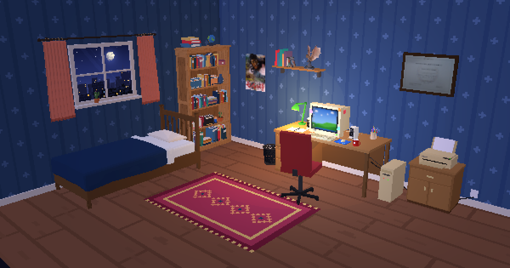

# Chambre 98 : CV interactif en 3D

> Une chambre d'ado en pixel art, un vieux PC, un OS rétro… et mon CV caché à l'intérieur.

**▶ [Visiter la chambre](https://mehdi-pic.github.io/PORTFOLIO-DEV-3D/)**



**Chambre 98** est mon CV de développeur transformé en petite expérience 3D jouable directement dans le navigateur.
Plutôt qu'une page à faire défiler, le visiteur entre dans une chambre de nuit, s'installe au bureau et allume l'ordinateur pour découvrir mon parcours.

---

## L'expérience

### 🛏️ La chambre
Une chambre modélisée dans **Blender** et rendue avec **Three.js** en basse résolution, sans lissage, pour un vrai rendu *pixel art*. Les ombres sont en aplats (*toon shading*) et l'éclairage est celui d'une chambre de nuit : clair de lune, lampe de bureau et lueur bleutée de l'écran.

Par la fenêtre, une **ville de nuit** : un shader calcule ce que l'œil verrait à travers la vitre. Trois rangées d'immeubles à des profondeurs différentes créent une vraie parallaxe quand la caméra bouge, sous un ciel étoilé.

### 🖥️ CV-OS 98
Un clic sur le PC et la caméra plonge dans l'écran : un **système d'exploitation rétro** façon fin des années 90 démarre dans le moniteur cathodique (séquence de boot, lignes de balayage, reflet et vignettage de l'écran).

Tout le CV y est rangé comme sur un vrai bureau :

| Icône | Contenu |
|---|---|
| 🪪 **À propos** | Qui je suis, dans un Bloc-notes |
| 💼 **Expériences** | Mes postes, un fichier par expérience |
| 🎓 **Formations** | Mes diplômes, avec la présentation et les photos de chaque école |
| ⚙️ **Compétences** | Classées par domaine : dev, DevOps & cloud, data & BI, infra, méthodes, langues |
| 🚀 **Projets** | Dont [GenDon](https://gendon.fr) et… ce CV lui-même |
| 🎮 **Loisirs** | Cinéma, vélo, basket-ball |
| ✉️ **Contact** | Carnet d'adresses : e-mail, LinkedIn, GitHub |

Fenêtres déplaçables, barre des tâches, menu Démarrer, horloge, illustrations en pixel art affichées en polaroïds punaisés… tout y est.

### 🔍 Les objets de la chambre
Le PC n'est pas le seul objet interactif :

- **Le diplôme** accroché au mur, qu'on peut regarder de près.
- **L'étagère** :
  - des **Blu-ray** : chaque boîtier peut être sorti, tourné dans tous les sens et reposé. Ils ont leur propre rendu glacé, avec vernis et reflets, qui contraste avec le reste de la chambre ;
  - une **figurine de Rathalos** posée en vol sur un socle rocheux modélisé dans Blender.
- **L'imprimante** : un clic lance l'impression de mon CV. La feuille sort, tombe en virevoltant et s'empile au sol, pendant que le fichier est téléchargé.

### 🔊 Le son
Tous les bruitages (boot, clics, fenêtres, imprimante…) sont **synthétisés en temps réel avec WebAudio**. Le projet ne contient aucun fichier audio.

---

## Sous le capot

- **Three.js** pour le rendu 3D, chargé depuis un CDN. Pas de framework, pas de bundler, pas de build : du HTML, du CSS et des modules JavaScript natifs.
- **Blender** pour la modélisation de la chambre, exportée en glTF (`.glb`).
- **Textures générées en code** sur canvas (tapis, fond d'écran, icônes, illustrations 44×44…), pour garder un style pixel art cohérent.
- **Rendu pixelisé** : la scène est dessinée en petite résolution puis agrandie au plus proche voisin.
- **Responsive** : la caméra et l'OS s'adaptent aux écrans portrait et mobiles.
- **Contenu séparé du moteur** : tout le CV tient dans un seul fichier de données (`js/cv-data.js`). Le reste de l'interface s'adapte automatiquement.

```
├── index.html
├── css/style.css
├── js/
│   ├── main.js       # scène 3D, caméra, interactions, imprimante, Blu-ray
│   ├── os.js         # CV-OS 98 : bureau, fenêtres, menu Démarrer
│   ├── cv-data.js    # tout le contenu du CV
│   ├── city.js       # shader de la ville vue par la fenêtre
│   ├── textures.js   # textures pixel art générées
│   ├── pixelart.js   # illustrations des polaroïds
│   ├── icons.js      # icônes de l'OS
│   └── sound.js      # sons synthétisés (WebAudio)
├── assets/           # modèles 3D, affiches, photos, CV téléchargeable
└── blender/          # fichier source Blender de la chambre
```

---

## Auteur

**Mehdi PICHARD**, développeur

[LinkedIn](https://www.linkedin.com/in/mehdi-pichard) · [GitHub](https://github.com/Mehdi-Pic) · [adresse dans le carnet de contact du site](https://mehdi-pic.github.io/PORTFOLIO-DEV-3D/)
